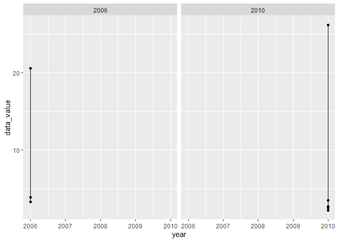
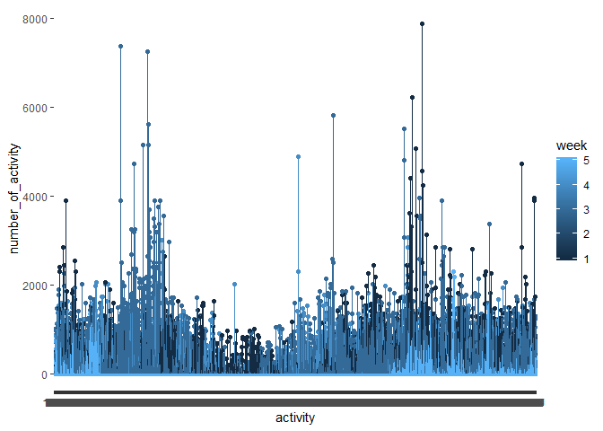

p8105\_hw3\_ml4418
================
Mengyuan Li
10/8/2019

``` r
library(tidyverse)
```

    ## -- Attaching packages ------------------------------------------------------------------ tidyverse 1.2.1 --

    ## v ggplot2 3.2.1     v purrr   0.3.2
    ## v tibble  2.1.3     v dplyr   0.8.3
    ## v tidyr   1.0.0     v stringr 1.4.0
    ## v readr   1.3.1     v forcats 0.4.0

    ## -- Conflicts --------------------------------------------------------------------- tidyverse_conflicts() --
    ## x dplyr::filter() masks stats::filter()
    ## x dplyr::lag()    masks stats::lag()

# problem 1

``` r
library(p8105.datasets)
data("instacart")


aisles = select(instacart, "aisle")
aisles = unique(aisles)
aisles_number = nrow(aisles)

instacart %>%
  group_by(aisle) %>%
  summarise(number_of_order = n()) %>%
  filter(number_of_order == max(number_of_order))
```

    ## # A tibble: 1 x 2
    ##   aisle            number_of_order
    ##   <chr>                      <int>
    ## 1 fresh vegetables          150609

``` r
instacart
```

    ## # A tibble: 1,384,617 x 15
    ##    order_id product_id add_to_cart_ord~ reordered user_id eval_set
    ##       <int>      <int>            <int>     <int>   <int> <chr>   
    ##  1        1      49302                1         1  112108 train   
    ##  2        1      11109                2         1  112108 train   
    ##  3        1      10246                3         0  112108 train   
    ##  4        1      49683                4         0  112108 train   
    ##  5        1      43633                5         1  112108 train   
    ##  6        1      13176                6         0  112108 train   
    ##  7        1      47209                7         0  112108 train   
    ##  8        1      22035                8         1  112108 train   
    ##  9       36      39612                1         0   79431 train   
    ## 10       36      19660                2         1   79431 train   
    ## # ... with 1,384,607 more rows, and 9 more variables: order_number <int>,
    ## #   order_dow <int>, order_hour_of_day <int>,
    ## #   days_since_prior_order <int>, product_name <chr>, aisle_id <int>,
    ## #   department_id <int>, aisle <chr>, department <chr>

``` r
plot = instacart %>%
  group_by(aisle) %>%
  summarise(number_of_order = n()) %>%
  filter(number_of_order >= 10000) %>%
  ggplot(aes(x = number_of_order , y = aisle, color = aisle)) + 
  geom_point() +
  labs(title = "Number of Orders plot",
    x = "Aisle Category",
    y = "Number of Orders")


table_order_number = instacart %>%
  filter(aisle == c( "baking ingredients", "dog food care", "packaged vegetables fruits")) %>%
  group_by(aisle,product_name) %>%
  summarise(total_number = n())
table_1 = filter(table_order_number, aisle == "baking ingredients") %>%
  mutate(total_number = sort(total_number))
table_2 = filter(table_order_number, aisle == "dog food care") %>%
  mutate(total_number = sort(total_number))
table_1 = filter(table_order_number, aisle == "packaged vegatables fruits") %>%
  mutate(total_number = sort(total_number))


apple = filter(instacart, product_name == "Pink Lady Apples")
ice_cream = filter(instacart, product_name == "Coffee Ice Cream")
combine = bind_rows(apple, ice_cream) %>%
  select(order_dow, order_hour_of_day, product_name) %>%
  mutate(order_dow = factor(order_dow, labels = c("Sunay", "Monday", "Tuesday", "Wednesday", "Thursday", "Friday", "Saturday"))) %>%
  group_by(product_name, order_dow) %>%
  summarise(mean_hour = mean(order_hour_of_day)) %>%
  pivot_wider(names_from = order_dow,
              values_from = mean_hour) 
combine
```

    ## # A tibble: 2 x 8
    ## # Groups:   product_name [2]
    ##   product_name     Sunay Monday Tuesday Wednesday Thursday Friday Saturday
    ##   <chr>            <dbl>  <dbl>   <dbl>     <dbl>    <dbl>  <dbl>    <dbl>
    ## 1 Coffee Ice Cream  13.8   14.3    15.4      15.3     15.2   12.3     13.8
    ## 2 Pink Lady Apples  13.4   11.4    11.7      14.2     11.6   12.8     11.9

The size of dataset is 1384617 \* 15. The dataset follows primitive
structure, which means there are many parallel subfactors that
reasearchers want to consider. Some varaibles are very important, which
can be considered as key variables. For example, “reorder” is a key
varaible because it reflects the popularity of a certain product. Also,
“day\_since\_prior\_order” is another key variable because it refelcts
how often customers purchase a certain product. Here is an example of
observations. For the first obeservation whith order ID of 1 in the
dateset, he purchased a product with ID 11109 for 4 times. This is the
second product he selected and added into cart. He reordered this
product pretty often.

Answers: There are 134 aisles. Fresh vegetables are the most items
ordered from, and the number of orders is 150609.

# problem 2

``` r
library(p8105.datasets)
data("brfss_smart2010")
library(ggplot2)

brfss_smart2010 = janitor::clean_names(brfss_smart2010)
brfss_tidy = filter(brfss_smart2010, 
                    topic == "Overall Health", 
                    response == c("Excellent", "Poor")) %>%
  mutate(response = factor(response, levels = c("Poor","Excellent"), labels = c(0,1))) 
```

    ## Warning in response == c("Excellent", "Poor"): longer object length is not
    ## a multiple of shorter object length

``` r
brfss_2002 = filter(brfss_tidy, year == "2002") %>%
  group_by(locationabbr) %>%
  summarise(observing_number = n_distinct(locationdesc)) %>%
  filter(observing_number >= 7) 
  
  
  brfss_2010 = filter(brfss_tidy, year == "2010") %>%
    group_by(locationabbr) %>%
    summarise(observing_number = n_distinct(locationdesc)) %>%
    filter(observing_number >= 7) 

  brfss_excellent = filter(brfss_tidy, response == 1) %>%
    group_by(locationabbr, year) %>%
    summarise(average = sum(data_value)/n()) 
  
plot_1 = ggplot(brfss_excellent, aes(year, average , color = locationabbr)) +
  geom_line(aes(group = locationabbr))

data_value = filter(brfss_tidy, year == c("2006","2010"), locationabbr == "NY") %>%
  group_by(year) %>%
  ggplot(aes(year, data_value)) + geom_point() + geom_line() + facet_grid(~year)
```

    ## Warning in year == c("2006", "2010"): longer object length is not a
    ## multiple of shorter object length

``` r
data_value
```

<!-- --> Answers: In
2002, CT, FL, MA, NC, NJ, PA were observed at 7 or more locations. In
2010, CA, CO, FL, ID, MA, MD, NC, NE, NJ, NM, NY, OH, PA, SC, TX, UT, WA
were observed at 7 or more locations.

# problem 3

``` r
accel_data = read.csv("accel_data.csv")
accel_data = janitor::clean_names(accel_data) 
 
 
data_1 = filter(accel_data, day == c("Monday", "Tuesday", "Wednesday", "Thursday", "Friday")) %>%
  mutate(weekday_weekend = "weekday")

data_2 = filter(accel_data, day == c("Saturday", "Sunday")) %>%
  mutate(weekday_weekend = "weekend")
```

    ## Warning in `==.default`(day, c("Saturday", "Sunday")): longer object length
    ## is not a multiple of shorter object length

    ## Warning in is.na(e1) | is.na(e2): longer object length is not a multiple of
    ## shorter object length

``` r
data = bind_rows(data_1, data_2)


total_activity = mutate(data, total_activity = rowSums(data[4:1443])) %>%
  select(week, day, total_activity)
data_tidy = pivot_longer(data,
                         cols = 4:1443,
                         names_to = "activity",
                         values_to = "number_of_activity",
                         names_prefix = "activity_")
new_data = data_tidy %>%
  group_by(week,day_id) %>%
  ggplot(aes(activity, number_of_activity, color = week)) + geom_point() +geom_line()
new_data
```

<!-- --> There are 35
observations. The variables include week, day, and activity counts for
each minute of a 24-hour day starting at midnight.
